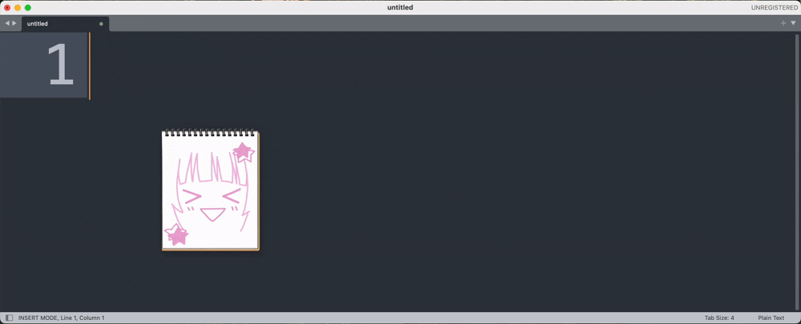

# TOKIMEKI BOARD




## ✨ 주요 기능 (Features)

- **마우스 트래킹**: 토키메키 보드가 마우스 커서를 졸졸 따라다닙니다.
- **키보드 반응형 표정 변화**:
    - 타이핑을 할 때마다 도키메키 보드의 표정이 다이나믹하게 변합니다.
    - 특정 키를 누르면 지정된 감정으로 표정으로 바뀝니다.
- **커스텀 디자인**: 모든 표정 에셋은 Figma를 통해 한 땀 한 땀 직접 그렸습니다.
- **크로스 플랫폼 지원**: Windows와 macOS 환경을 모두 지원합니다.

## 🚀 설치 방법 (Installation)

[ [Releases](https://www.notion.so/releases) ] 페이지로 이동 후 아래 가이드를 참고해주세요.

<br>

| 플랫폼 | 설치가이드                                   |
|-----|-----------------------------------------|
| 윈도우 | [바로가기](./docs/install_guide/windows.md) |
| 맥   | [바로가기](./docs/install_guide/macos.md)   |

## 🛠 빌드 및 개발 (Development)

이 프로젝트는 Python, PyQt6, pynput 등 을(를) 기반으로 제작되었습니다.

```bash
# 1. 저장소 클론 및 디렉토리 이동
git clone https://github.com/nightletter/TOKIMEKI-BOARD.git
cd TOKIMEKI-BOARD

# uv 설치
# pip install uv

# 2. 의존성 패키지 설치 (가상환경 자동 생성 및 활성화)
uv sync

# 3. 프로그램 실행
uv run main.py
```