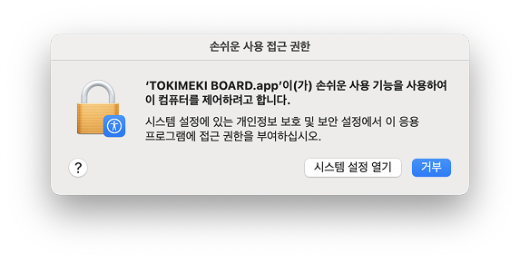

## 맥 설치 가이드

 

| 플랫폼                  | 파일명                               |
|----------------------|-----------------------------------|
| intell mac           | TOKIMEKI BOARD-macos-x64.tar.gz   |
| silicon mac(m1,m2..) | TOKIMEKI BOARD-macos-arm64.tar.gz |

 

1. 다운 받은 TOKIMEKI BOARD-macos.tar.gz 를 압축을 풀고 '응용프로그램' 으로 올겨주세요.
2. 실행 시 '손쉬운 사용 접근 권한'을 요구합니다.

3. 설정의 '손쉬운 사용'에서 'TOKIMEKI BOARD'를 활성화 시켜주세요. 

